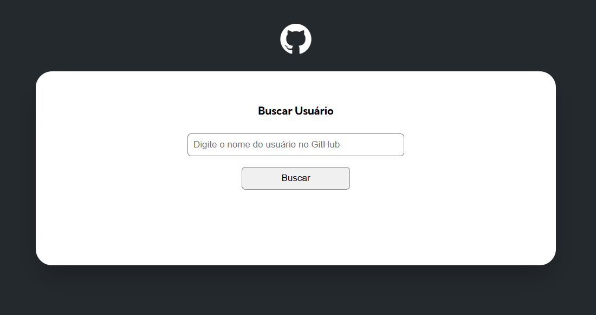
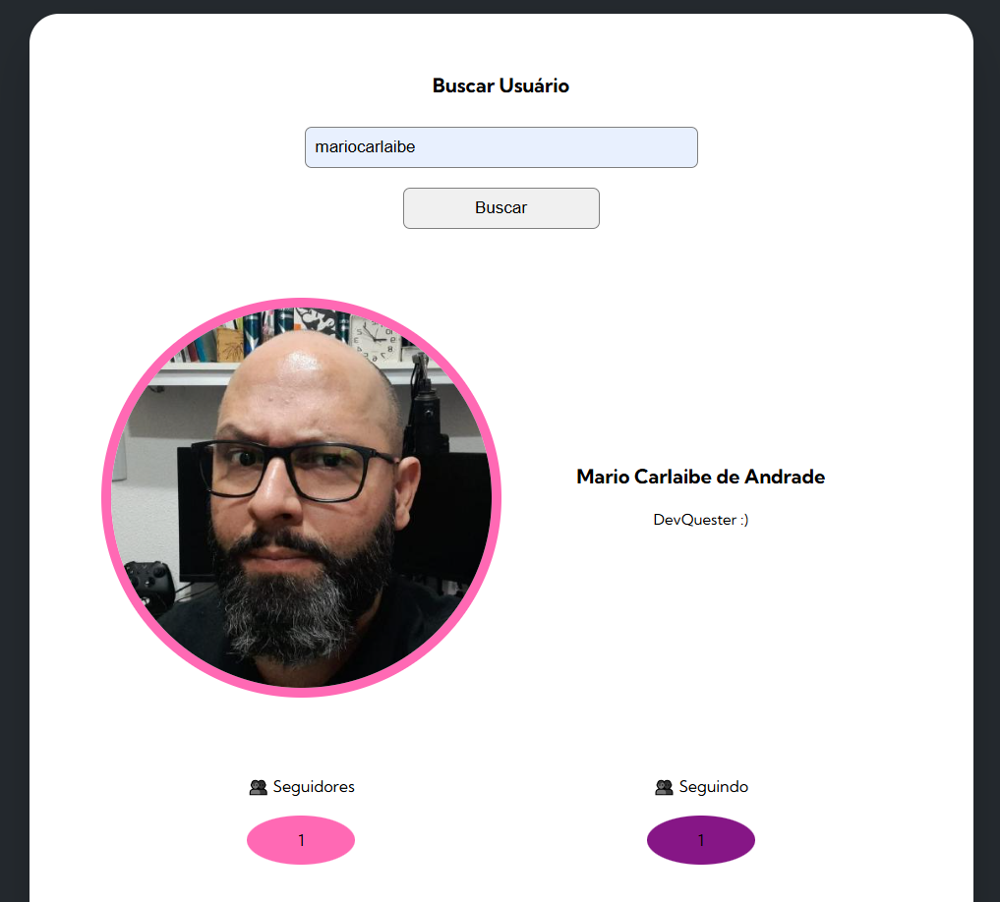

# Projeto inicial usando Fetch com a API do GitHub

Essa é a solução da Quest de Javascript Avançado do curso DevQuest.

## Índice

- [Visão geral](#visão-geral)
- [O desafio](#o-desafio)
- [Captura de tela](#captura-de-tela)
- [Links](#links)
- [Meu processo](#meu-processo)
- [Construído com](#construído-com)
- [O que aprendi](#o-que-aprendi)
- [Agradecimentos](#agradecimentos)

## Visão geral

### O desafio

Nesse desafio vamos simular novas solicitações feitas pelo seu gerente de projeto, a serem acrescentadas no projeto.
1- acrescentar novas informações do usuário: números de seguidores e seguidos.
2- acrescentar na tela de busca uma lista dos 10 últimos eventos do usuário: o nome do repositório e o commit.
3- acrescentar outras informações dos repositórios: número de forks, estrelas, visualizações e qual a linguagem de progamação usada no projeto.

### Captura de tela

### Links

- URL do Projeto: [projeto-inicial-fetch-github-api](https://github.com/MarioCarlaibe/projeto-inicial-fetch-github-api)
- URL do site ativo: [https://mariocarlaibe.github.io/projeto-inicial-fetch-github-api/](https://mariocarlaibe.github.io/projeto-inicial-fetch-github-api/)

## Meu processo

### Criado com

- HTML5
- CSS
- Javascript
- API GitHub

### O que aprendi

Esse foi meu primeiro Projeto usando Javascript junto com uma API. Apredi que o melhor método para aprender é a prática. Nesse projeto entendi melhor a usar o console.log, verificar erros e como resolvê-los, como buscar informações na API, quais são a tags para setar as informações na API, mas acima de tudo, aprendi a dar valor em mim mesmo, que é possivel atingir a excelência na programação. O processo pode ser lento, mas a conquista é gloriosa.

## Agradecimentos

Agradeço ao DevQuest pelo conhecimento adquirido, as instruções fornecidas e aos monitores fantásticos.